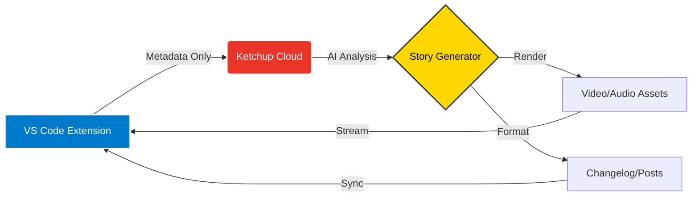

<div align="center">
  <picture>
    <source media="(prefers-color-scheme: dark)" srcset="assets/logo-dark.svg">
    <source media="(prefers-color-scheme: light)" srcset="assets/logo-light.svg">
    
  </picture>

  # 🍅 Ketchup for VS Code

  **Catch up on your code.**
  <br>
  *Turn your git commits into cinematic story recaps without leaving your editor.*

  [](https://marketplace.visualstudio.com/items?itemName=ketchup.ketchup-vscode)
  [](https://marketplace.visualstudio.com/items?itemName=ketchup.ketchup-vscode)
  [](LICENSE)
  [](https://www.typescriptlang.org/)

  <p align="center">
    <b>Ketchup</b> is the AI-native narrative engine for engineering teams. <br />
    Connect your repository, select commits, and let AI craft narrative updates complete with video recaps, changelogs, and social media posts.
  </p>
</div>

---

## ✨ Features

### 🎬 Draft Recaps from Your Editor
No more context switching. Draft your updates right where you code.
- **Select Time Ranges**: Quickly grab the last 7, 14, or 30 days of work.
- **Filter Contributors**: Focus on your work or see the team's velocity.
- **Cherry-pick Commits**: Select specific changes to include in your story.

### 📖 View Story Points
Turn raw commits into a compelling narrative.
- **AI-Generated Summaries**: Understand the "why" behind the code.
- **Risk Assessment**: Automatic Low/Medium/High grading.
- **Smart Categorization**: Features, Fixes, Refactors, and Chore detection.

### 🎨 Generate Assets
One click, multiple formats.
- **Audio Recaps**: AI-narrated summaries for on-the-go updates.
- **Video Recaps**: Cinematic visualizations powered by Remotion & Veo.
- **Changelogs**: instant Markdown release notes.
- **Social Posts**: Ready-to-share updates for X and LinkedIn.

### 🔐 Privacy First
Designed for security-conscious teams.
- **Cloud Mode (Default)**: Sends *only* metadata and commit SHAs. **Code stays local.**
- **Safe by Default**: Respects `.gitignore` and never touches secrets.
- **Enterprise Ready**: SOC-2 compliant architecture (upcoming).

---

## 🚀 Getting Started

### 1. Install
Search for **"Ketchup"** in the VS Code marketplace or install directly:
`ext install ketchup.ketchup-vscode`

### 2. Connect
1. Click the **Ketchup icon** in the Activity Bar.
2. Hit **"Connect to Ketchup"**.
3. Authenticate securely with GitHub.

### 3. Create
1. Click the `+` icon in the Recaps view.
2. Select your timeframe.
3. Watch as Ketchup turns your git history into a story.

---

## ⚙️ Configuration

Customize your experience in `settings.json`:

```jsonc
{
  // API endpoint (for self-hosted instances)
  "ketchup.apiUrl": "https://app.gitketchup.com",

  // Operation mode
  "ketchup.mode": "cloud", // "cloud" | "local" | "mixed"

  // Default time range for drafts (in days)
  "ketchup.defaultTimeRange": 7,

  // Auto-refresh recaps on startup
  "ketchup.autoRefresh": true
}
```

---

## 🛠️ Commands

| Command | Description |
|---------|-------------|
| `Ketchup: Connect Workspace` | Authenticate and connect your repo |
| `Ketchup: Draft Recap` | Start creating a new recap |
| `Ketchup: View Recap` | Open a recap in detail view |
| `Ketchup: Open in Browser` | View recap on Ketchup web app |

---

## 🏗️ Architecture



---

## 🤝 Contributing

We welcome contributions! This project is open source.

**Quick Start:**
```bash
git clone https://github.com/GitKetchup/ketchup-vscode.git
cd ketchup-vscode
npm install
# Press F5 to launch Extension Development Host
```

See [CONTRIBUTING.md](CONTRIBUTING.md) for details.

---

<div align="center">
  <br>
  <b>Made with ❤️ by the Ketchup Team</b>
  <br>
  <a href="https://gitketchup.com">Website</a> • 
  <a href="https://twitter.com/gitketchup">Twitter</a> • 
  <a href="https://gitketchup.com/discord">Discord</a>
</div>
